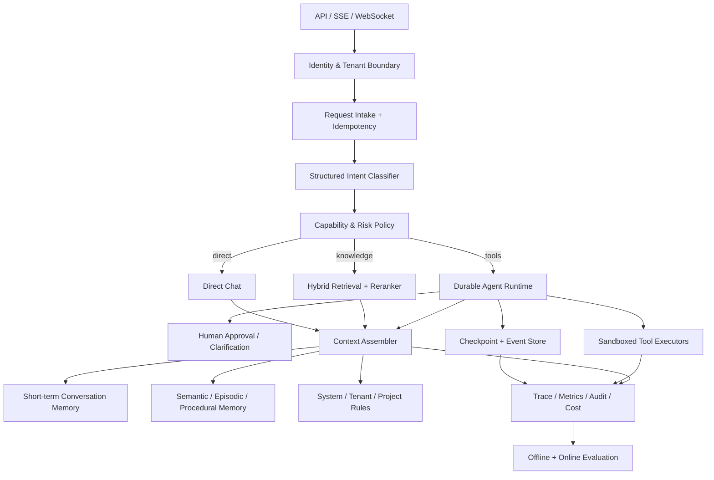
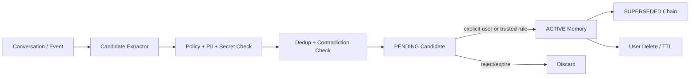

# Suvia Agent：面向业界 Harness 水平的目标架构与演进方案

## 1. 结论

本副本已经从教学型 ReAct Demo 提升为具备以下基础能力的 Agent 服务：

- 正确的 Agent 终止、最终答案和异常语义；
- 工作区文件、网络、下载和终端工具安全边界；
- 租户/用户/会话身份隔离与生产 JWT 入口；
- run/event/checkpoint 运行控制面；
- token-budget 短期记忆和受治理长期记忆；
- 结构化意图、风险识别、动态工具裁剪和统一任务路由；
- hybrid RAG 作为直接问答 Advisor 和 Agent capability；
- 离线单元测试与 live integration 测试分层。

它已经具备“可继续产品化”的骨架，但还不能严谨地宣称与 Claude Code、Codex、LangGraph 平台或 OpenHands 在所有方面等价。完整业界水平的主要缺口是：可恢复执行、人机审批、真正的沙箱、生产级迁移/队列/租约、全链路观测、规模化评测、长期记忆矛盾治理和 RAG rerank/引用评测。

## 2. 参考基线

本方案以官方公开资料和可观察协议为依据，不推测闭源内部实现：

- [Anthropic Claude Code 官方仓库](https://github.com/anthropics/claude-code)公开的是产品入口、插件、变更记录和文档链接，并未提供完整核心 harness 源码；因此本文依据其官方 CLI、权限、会话恢复、hooks、memory 和 changelog 行为，不声称复刻私有内核。
- [Claude Code CLI 官方文档](https://docs.anthropic.com/en/docs/claude-code/cli-usage)明确提供 permission mode、resume/continue、max turns 和非交互输出等宿主级控制。
- [OpenAI Codex app-server 协议](https://github.com/openai/codex/blob/main/codex-rs/app-server/README.md)公开了 thread/turn/item 事件、命令审批、权限请求和恢复交互；[Codex 协议源码](https://github.com/openai/codex/blob/main/codex-rs/protocol/src/protocol.rs)公开了细粒度审批策略。
- [LangGraph persistence](https://docs.langchain.com/oss/python/langgraph/persistence)把每步图状态保存为 checkpoint，用于 human-in-the-loop、回放、故障恢复和 time travel。
- [OpenHands 架构](https://github.com/All-Hands-AI/OpenHands/blob/main/openhands/README.md)以 EventStream 连接 AgentController、State、Runtime、Action 和 Observation。
- [Spring AI Alibaba 官方仓库](https://github.com/alibaba/spring-ai-alibaba)当前 Agent Framework/Graph 已覆盖 context engineering、HITL、动态工具选择、持久化、工作流和 streaming；[1.1.2.2 release](https://github.com/alibaba/spring-ai-alibaba/releases)还包含 sandbox、异步工具和多 Agent 模式。
- [Spring AI Alibaba 持久执行](https://java2ai.com/docs/frameworks/graph-core/examples/long-time-running-task/)与[人类反馈](https://java2ai.com/docs/frameworks/graph-core/examples/human-in-the-loop/)展示了 checkpoint 后暂停和恢复的目标能力。

## 3. 目标架构



关键点不是选择某一个框架，而是明确分离：

1. 模型负责提出意图、计划和动作。
2. 宿主负责身份、授权、审批、沙箱、超时和资源限制。
3. Runtime 负责状态、事件、幂等、暂停和恢复。
4. Context Assembler 负责预算与来源，不让聊天数组自然增长。
5. Memory Store 负责事实生命周期，不把摘要当永久事实。
6. Eval/Telemetry 负责证明系统在升级后没有退化。

## 4. 当前实现映射

| 领域 | 当前实现 | 当前成熟度 | 到完整生产线仍缺少 |
|---|---|---:|---|
| Agent loop | typed failure、max-step failure、真实 final output | 高 | cancellation、deadline、parallel tool calls |
| 工具安全 | 路径根、SSRF、大小/超时、终端 allowlist、结构化结果 | 中高 | OS/container sandbox、egress proxy、审批 |
| 身份隔离 | JWT profile、tenant/user 会话 hash、owner-scoped query | 中高 | RBAC/ABAC、service identity、审计导出 |
| 运行控制面 | run ID、状态、事件、步骤 checkpoint | 中 | 完整 state serialization、worker lease、resume |
| 短期记忆 | token 预算、滚动摘要、CAS、安全标记 | 中高 | 真实 tokenizer、异步摘要、schema migration |
| 长期记忆 | 类型/来源/作用域/置信度/软删除/去重 | 中 | 候选确认、矛盾/时序、加密、向量检索 |
| 意图路由 | TaskSpec、风险、capability、fail-closed tool selection | 中 | 模型分类器、概率校准、大规模黄金集 |
| RAG | vector + keyword + RRF、query rewrite、Agent tool | 中 | reranker、citation verification、ACL filter eval |
| API | chat/RAG/agent/统一 task、SSE、run query、memory CRUD | 中高 | async submit/poll/cancel、idempotency key |
| 观测 | 安全日志、事件元数据 | 中低 | OpenTelemetry、Prometheus、token/cost/SLO |
| 评测 | 54+ 离线测试、15 条 routing golden cases | 中低 | 真实任务 benchmark、回放、LLM judge 校准 |

## 5. 记忆管理目标方案

### 5.1 四种不同状态不能混用

| 状态 | 示例 | 存储 | 生命周期 |
|---|---|---|---|
| 当前工作上下文 | 当前请求、最近消息、工具 schema | prompt/context assembler | 单次 turn |
| 会话短期记忆 | 最近多轮、滚动摘要 | chat memory | 单会话 |
| Agent 执行状态 | 当前节点、待审批动作、重试计数 | checkpoint/event store | 单 run |
| 长期记忆 | 用户稳定偏好、已确认事实、可信规则 | governed memory store | 跨会话、有 TTL/删除 |

### 5.2 推荐的长期记忆写入流程



模型只能生成 candidate，不能直接获得永久写权限。工具观察必须先变成带引用的事实候选；procedural memory 只能来自系统/组织策略。召回时先做 tenant/user/scope/ACL/有效期过滤，再做 lexical + vector retrieval 和 rerank，最后以低信任数据块注入。

### 5.3 记忆评测

至少建立：

- fact retention / fact precision；
- contradiction resolution accuracy；
- stale memory rate；
- secret/PII write rejection rate；
- prompt-injection persistence rate，目标必须接近 0；
- delete/export completeness；
- token saving、摘要延迟和长期召回延迟。

## 6. 意图识别目标方案

### 6.1 分层分类

1. 安全规则层：否定词、终端/写入/下载等高风险动作，偏高 precision。
2. 小模型结构化分类层：输出 JSON Schema `TaskSpec`，不拥有授权权力。
3. 策略层：把请求能力与身份、环境和管理员策略求交集。
4. 澄清/审批层：低置信度、高风险或冲突时暂停。
5. 执行层：只接收最终 grant 的 capability。

### 6.2 指标

不能只看 intent accuracy；需要逐 capability 统计：

- precision / recall / F1；
- 高风险 false positive rate；
- unnecessary clarification rate；
- route latency 和额外模型成本；
- direct/RAG/agent 路由后的任务成功率；
- 工具 schema token 节省率。

上线应先 shadow：新分类器只记录建议，不改变现有路由；通过黄金集和真实回放后逐步放量。

## 7. Durable Runtime 与审批

当前步骤 checkpoint 只能审计，不能完整恢复。下一版运行协议应采用：

```text
RUNNING
  -> TOOL_REQUESTED
  -> WAITING_APPROVAL
  -> TOOL_APPROVED | TOOL_DENIED
  -> TOOL_STARTED
  -> TOOL_COMPLETED | TOOL_FAILED
  -> CHECKPOINT_SAVED
  -> RUNNING | WAITING_USER | SUCCEEDED | FAILED | CANCELLED
```

每个 tool call 使用稳定 call ID 和幂等键。审批事件保存动作摘要、目标资源、风险、可选授权范围和决策人；敏感参数单独加密，不进入普通事件 JSON。Worker 通过 lease + heartbeat 防止双执行，外部副作用采用 outbox 或业务幂等键。

这与 Codex app-server 的 item/approval、LangGraph checkpoint/interrupt 和 Spring AI Alibaba Graph HITL 的方向一致。

## 8. RAG 目标方案

当前 RRF 是合理基线，下一步应形成：

1. query classification：是否需要检索、需要哪个 corpus。
2. query rewrite/decomposition：失败时回退原查询。
3. metadata/ACL filter：必须在召回前执行。
4. dense + lexical 多路召回。
5. RRF 合并。
6. cross-encoder 或专用 reranker。
7. context packing：去重、diversity、token budget。
8. answer with citations。
9. citation entailment / completeness verification。

评测使用固定语料和 question-answer-evidence 集，至少测 Recall@K、MRR/nDCG、answer correctness、faithfulness、citation precision/recall、拒答正确率和延迟成本。

## 9. 框架选择建议

### 近期：保留 Spring，升级依赖基线

当前项目使用 `spring-ai-alibaba-starter 1.0.0-M6.1` 和多个 Spring AI `1.0.0-M6`。官方当前稳定线已经发展到 Spring AI Alibaba `1.1.2.2`，包含 Agent Framework、Graph、动态工具选择、HITL、sandbox 和异步工具。建议建立独立迁移分支：

1. 先引入官方 BOM，消除逐个 M6 版本钉死。
2. 升级 Spring AI/Alibaba 到同一兼容矩阵。
3. 迁移 ToolCallback、Advisor、ChatMemory、RAG API。
4. 用现有 50+ 离线测试锁住行为。
5. 再将 `TaskOrchestrator` 迁移为 Graph 节点。

不要在主功能分支直接替换版本；M6 到 1.1.x 存在 API 和行为变化。

### 中期：使用显式图 Runtime

如果系统主要面向 Java/Spring 团队，优先评估 Spring AI Alibaba Agent Framework/Graph；如果需要最成熟的 Python 生态和 LangSmith 平台，评估 LangGraph；如果核心场景是完整 coding agent sandbox，可参考 Codex/OpenHands 的 runtime 分层，而不是强行把所有动作塞进 Spring Advisor。

### 协议层：MCP

MCP 适合标准化工具、资源和 prompt 的发现与调用，不负责身份、业务授权、sandbox、checkpoint 或长期记忆治理。接入 MCP 时，server capability 仍需映射到本项目 `Capability`，未知 MCP 工具默认禁用。

## 10. 发布路线与验收门

### Release A：可靠单实例

- Flyway/Liquibase 替换运行时 DDL。
- Testcontainers PostgreSQL/pgvector 集成测试。
- 模型 API timeout/retry/circuit breaker。
- OpenTelemetry trace、Micrometer metrics、token/cost 记录。
- 500+ 意图黄金集，高风险 capability precision 达到约定阈值。

### Release B：可暂停与可恢复

- 异步任务提交、查询、取消。
- 完整 checkpoint state。
- tool requested/approval/result 事件。
- worker lease/heartbeat/idempotency。
- 写入与终端动作 UI 审批。

### Release C：受治理记忆与高质量 RAG

- memory candidate/confirmation/supersede。
- KMS 加密、TTL、export/delete/audit。
- hybrid retrieval + reranker + citation verification。
- RAG 与 memory 独立离线评测和线上漂移监控。

### Release D：规模化平台

- 多租户配额、限流、成本预算。
- 队列、水平扩缩、事件归档。
- prompt/tool/model 版本注册与灰度。
- red-team、故障注入、回放和发布阻断门禁。

## 11. 不应做的事情

- 不把所有历史消息、工具结果和 RAG 文档永久塞进 prompt。
- 不让模型输出的“intent=terminal”直接成为授权。
- 不把异常字符串作为正常回答。
- 不用单个向量库同时承载会话、执行状态和长期事实。
- 不在日志中记录模型完整思考、凭据、工具参数全文和私有文档。
- 不在没有回归数据的情况下直接升级 Agent 框架大版本。
- 不把 MCP、向量数据库或一个大模型误认为完整 Agent harness。
